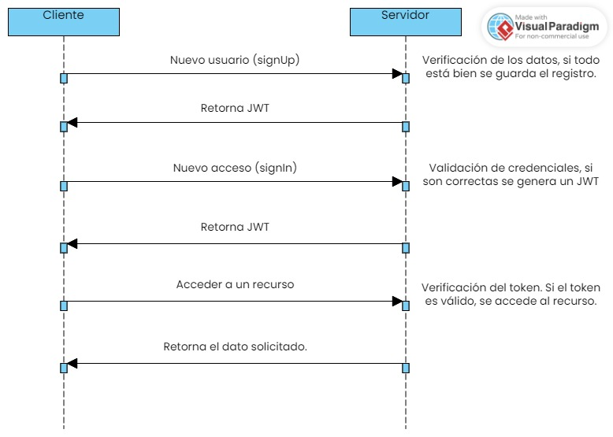
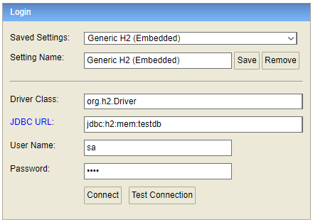
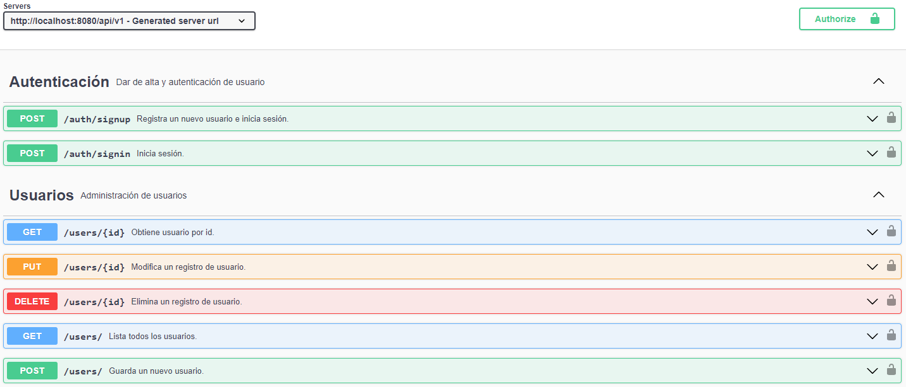

# Api de usuarios

Esta aplicación ofrece la funcionalidad de dar de alta a un usuario
y permitir acceso mediante un login que al ser exitoso devuelve
un token para acceder a los recursos.

Algunas de las herramientas usadas en la construcción de
este aplicativo fueron:

- Java 17
- Spring Boot 3.
- Jakarta EE 10
- H2 Database Engine.
- Bean Validation.
- JUnit 5.
- Mockito.

### Despliegue local

De manera general la aplicación funciona según se muestra en la siguiente imagen:

Una vez haya descargado el repositorio a su máquina local, únicamente deberá
cargar el proyecto con el ide de su preferencia y ejecutar la aplicación.

Se ha dejado el path '/api/v1' por defecto y usa el puerto convencional 8080.

Puede acceder a la consola web de H2 mediante la ruta '/api/v1/auth/h2-console/login.jsp'
cuya configuración la podemos encontrar en el archivo de configuración de spring.

Puede acceder a la información de los endpoints expuestos por esta api mediante swagger
'/api/v1/swagger-ui/'.

### Recursos

### <i class="ti ti-brand-pushover"></i> Colección Postman

Url de colección de Postman (también puede importar a partir del archivo security_import_postman.json):

> <i class="ti ti-external-link"></i> [https://documenter.getpostman.com/view/4583478/2sA3XMjPVz
](https://documenter.getpostman.com/view/4583478/2sA3XMjPVz
)